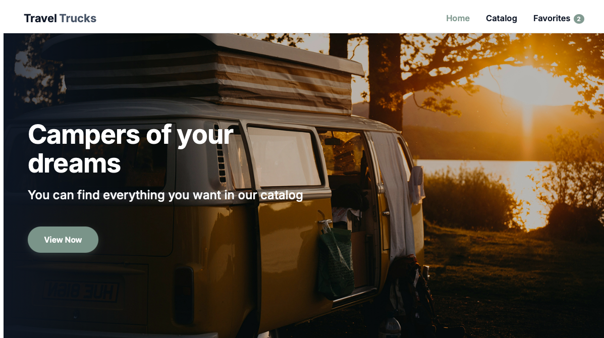
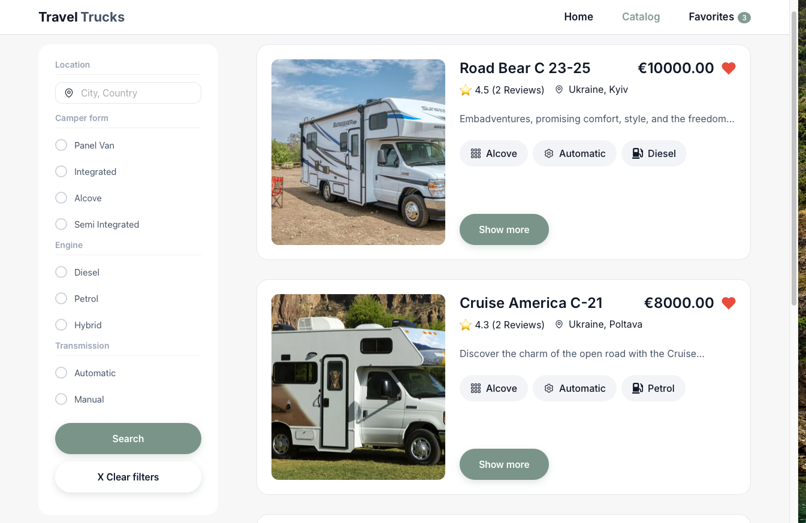
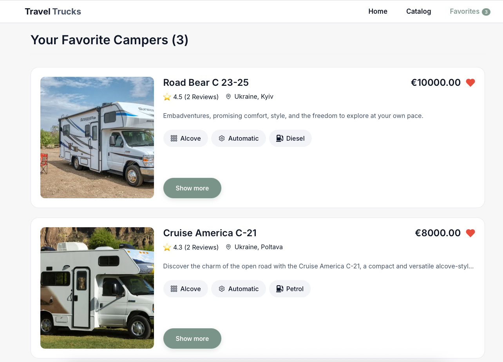
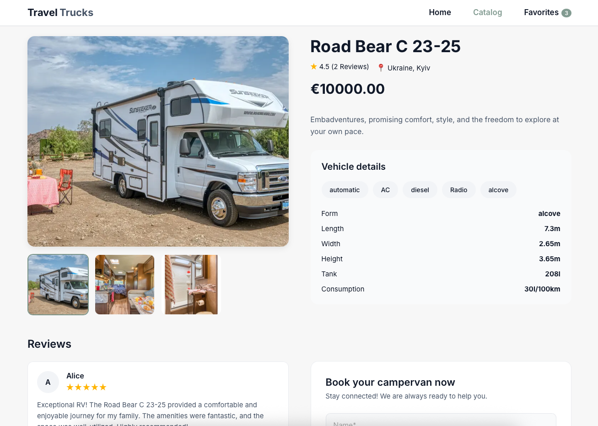
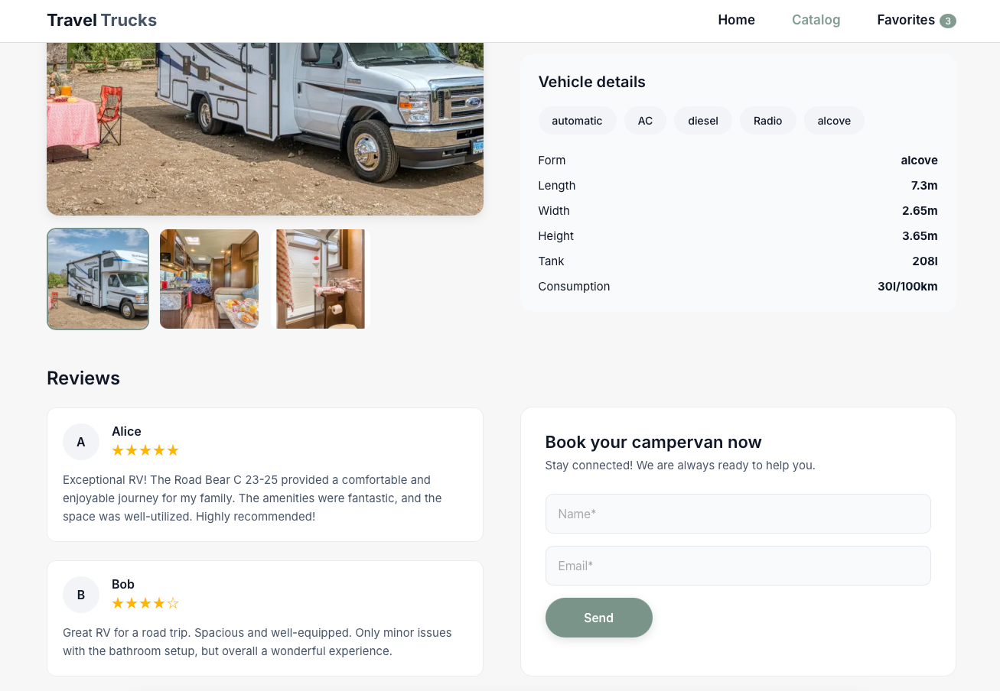

# 🚐 TravelTrucks Camper Rental Application

A modern, responsive camper rental web application built with **React**, **Redux Toolkit**, and **Vite**. The application allows users to browse available camper vans, filter them using multiple criteria, save favorites, and view detailed information for each camper.

## 🌐 Live Demo

**Live Website:** https://travel-trucks-theta-two.vercel.app

## 📂 GitHub Repository

https://github.com/HaticevanD/traveltrucks

---

## 📖 Project Overview

This project was developed as part of a frontend technical assessment for **TravelTrucks**, a camper rental company.

The application communicates with a REST API to retrieve camper listings and detailed camper information. Users can browse available campers, apply filters, manage their favorite campers, and explore detailed specifications before making a reservation.

---

## ✨ Features

- Browse all available camper vans
- Search campers by location
- Filter by:
  - Vehicle type
  - Transmission
  - Engine type
  - Equipment (AC, Kitchen, TV, Bathroom, etc.)

- View detailed camper information
- Camper image gallery
- Customer reviews with star ratings
- Reservation form
- Add/remove favorites
- Persistent favorites using Redux state
- Load More pagination
- Responsive design for desktop, tablet, and mobile
- Loading indicators during API requests
- Clean component-based architecture

---

## 🛠 Tech Stack

### Frontend

- React
- Vite
- React Router
- Redux Toolkit
- Axios

### Styling

- CSS Modules

### Icons

- React Icons

---

## 📁 Project Structure

src/
├── assets/
│ └── images/  
├── components/
│ ├── Button/
│ ├── CamperCard/
│ ├── Container/
│ ├── Filters/
│ ├── Header/
│ └── Loader/
├── pages/
│ ├── HomePage/
│ ├── CatalogPage/
│ ├── CamperDetailsPage/
│ └── FavoritesPage/
├── redux/
│ ├── campers/
│ │ ├── operations.js
│ │ └── slice.js
│ └── store.js
├── services/
│ └── api.js
├── App.jsx
├── main.jsx
└── index.css

## 📸 Application Preview

Home Page



Catalog Page & Filters



Favorites



Camper Details



Booking Form



## 🔌 API

Data is fetched from:

https://66b1f8e71ca8ad33d4f5f63e.mockapi.io/campers

Endpoints:

- `GET /campers`
- `GET /campers/:id`

---

## ⚙️ Installation

Clone the repository

```bash
git clone https://github.com/yourusername/traveltrucks.git
```

Navigate into the project

```bash
cd traveltrucks
```

Install dependencies

```bash
npm install
```

Start the development server

```bash
npm run dev
```

Build for production

```bash
npm run build
```

Preview production build

```bash
npm run preview
```

---

## 🎯 Learning Goals

This project focuses on:

- React component architecture
- Global state management with Redux Toolkit
- API integration using Axios
- Client-side routing
- Reusable UI components
- Responsive layouts
- Clean and maintainable code

---

## 👤 Author

**Hatice van Daalen**

GitHub: https://github.com/HaticevanD/

LinkedIn: https://linkedin.com/in/haticevand/

---

## 📄 License

This project was created for educational purposes as part of a frontend technical assessment.
